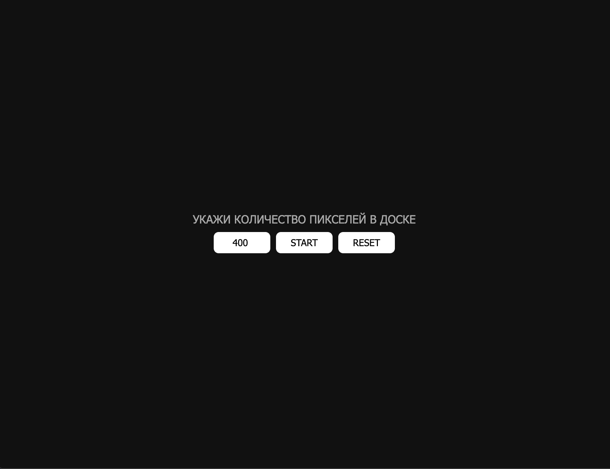
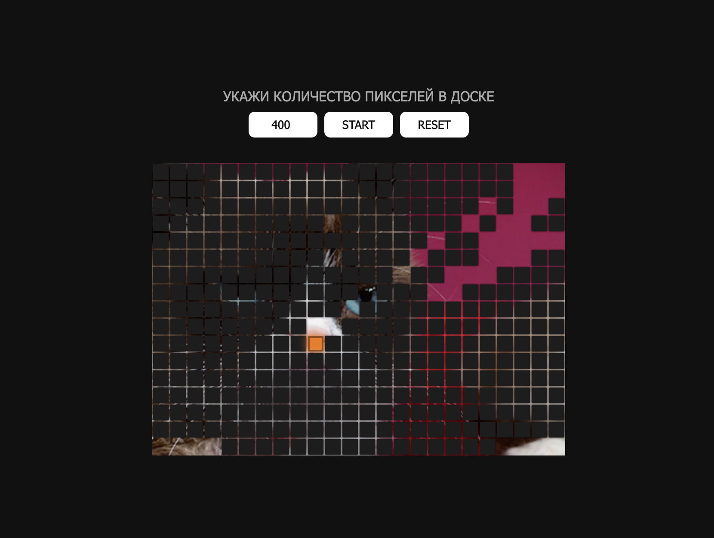
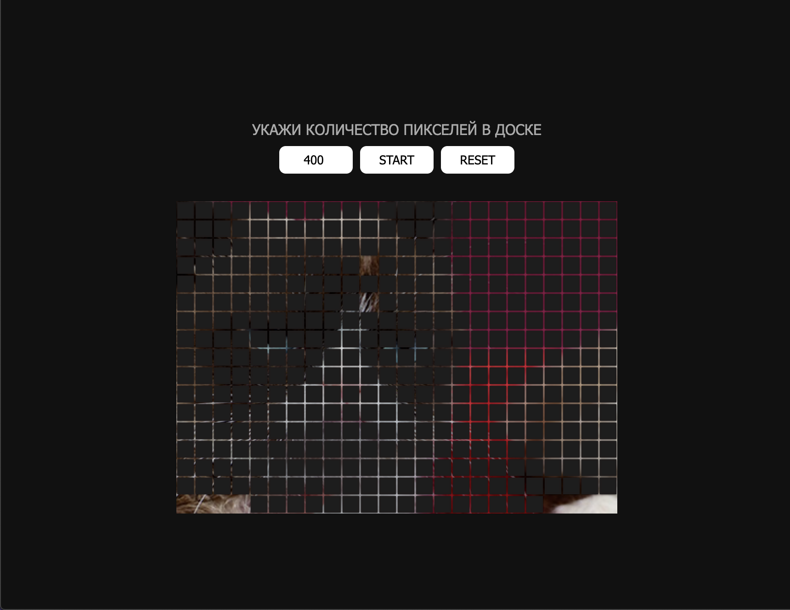

# HoverDesc
"The purpose of fixing mouse events and working with the DOM tree"

# About
Feel free to check out the code and don't forget to star the repo.⭐

Do you have a mouse? Or a touchbar? 
Great.
The screen will give you a choice of what scale you would like for the game, and then the cursor will clear the field to see what the pixel blocks are hiding behind them 

# See what's on display and try:
https://jsfiddle.net/burchikMax/pvn937c2/2/

# How to intall (Clone):
    1. Create folder in your local pc.
    2. Open this folder in your editor code.
    3. Open console, type "git clone https://github.com/burchik017/hoverDesc.git" .

